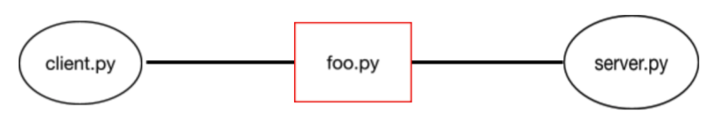

# Introduction-to-Communication-Networks
This is an implementation of UDP server as part of Intro to Communication Networks course at Bar Ilan University.
The main goal of this exercise is to define a protocol and use it to communicate between a UDP server to a client.

This is the given structure which server and client communicate:
Server -> foo -> Client
Client -> foo -> Server

Therefore, any message sent between the two, passes through foo. 
Foo has 4 modes:
1. Foo will only deliver packages that do not exceed 100 MB, otherwise it will drop the packages.
2. Additionally to 1, foo will randomly throw a certain percentage of the packages (in both directions).
3. Additionally to 1, foo will randomly delay a certain percentage of packages for a random period of time of no more than 5 seconds. As a result, packets may reach the server /      client in a different order from the order in which they were sent.
4. Finally, this mode will combine mode 1,2,3 all together = enforce size + throw packages + change packages order.

